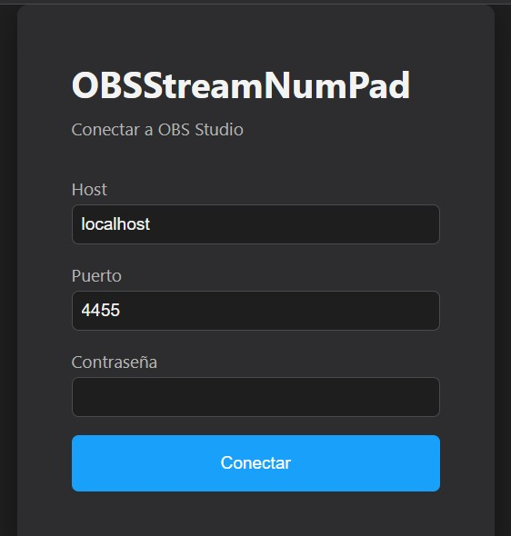
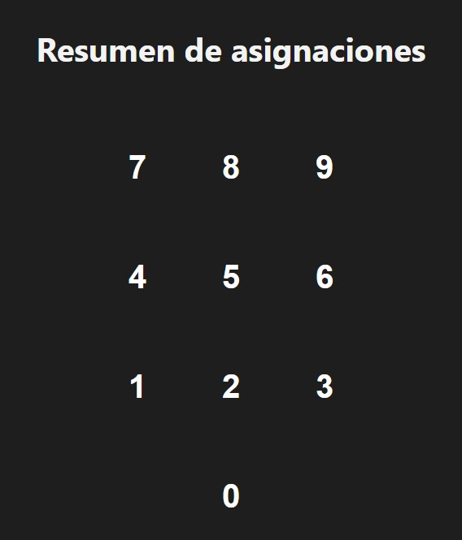
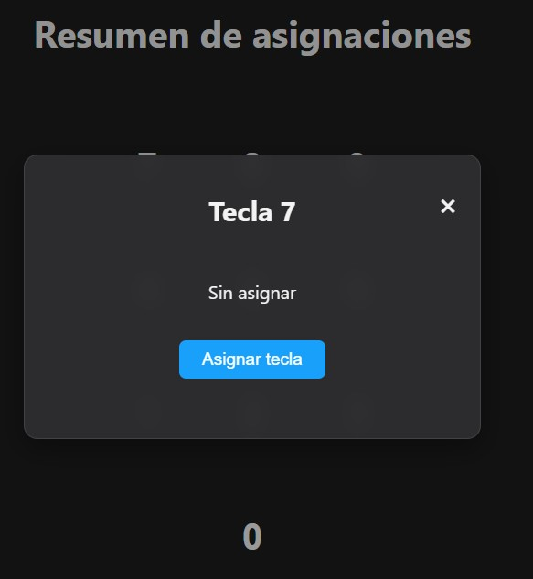
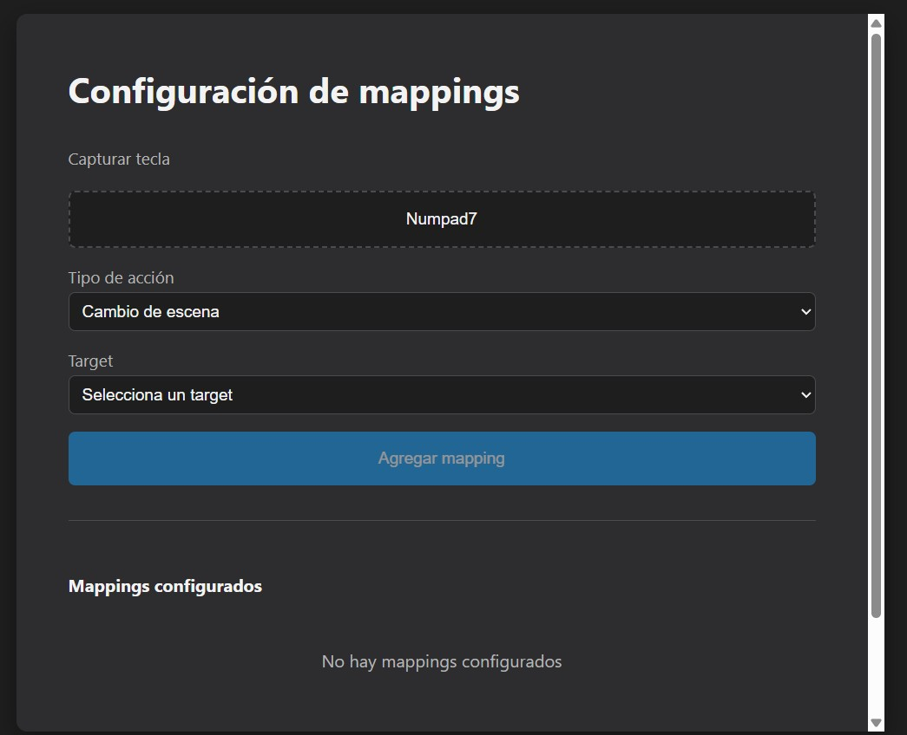
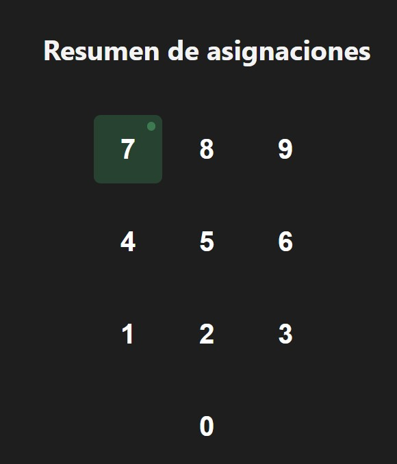

# OBSStreamNumPad

[🇧 English](README.md)

Convierte tu teclado numérico USB en un StreamDeck casero para OBS Studio.

## Funcionalidades

- **Cambio de escenas** — asigna una tecla del numpad para cambiar a cualquier escena de OBS
- **Control de medios** — reproduce/pausa fuentes multimedia con una sola tecla
- **Visibilidad** — muestra/oculta cualquier fuente de entrada
- **Configuración persistente** — los datos de conexión y las asignaciones se guardan automáticamente
- **Bilingüe** — español e inglés

## Requisitos

- **Windows** (única plataforma soportada por ahora)
- **OBS Studio** debe estar abierto
- Node.js 18+ (solo para desarrollo)

## Instalación

### Opción A: Descargar el .exe (recomendada)

1. Ve a [Releases](https://github.com/Eloytxo/OBSStreamNumPad/releases) y descarga el instalador `.exe` más reciente.
2. Ejecuta el instalador y sigue los pasos.
3. Abre **OBSStreamNumPad** desde el Menú Inicio o el acceso directo del escritorio.

> OBS Studio debe estar abierto antes de conectarte.

### Opción B: Desde el código fuente

```bash
git clone https://github.com/Eloytxo/OBSStreamNumPad.git
cd OBSStreamNumPad
npm install
npm run dev
```

Esto abre la app en modo desarrollo con hot-reload.

## Cómo obtener las credenciales de WebSocket de OBS

1. Abre **OBS Studio**.
2. Ve a **Herramientas → Ajustes del servidor WebSocket**.
3. Asegúrate de que el servidor WebSocket esté **habilitado**.
4. Haz clic en **Mostrar información de conexión** para ver el host, puerto y contraseña.

## Pantalla de conexión

Introduce el host, puerto y contraseña que te da OBS y haz clic en **Conectar**.



## Ventana resumen

Después de conectarte, verás el layout del numpad. Las teclas sin asignación aparecen vacías.



## Asignar tecla desde el resumen

Haz clic en cualquier tecla sin asignar para abrir el popup de detalle, y después en **Asignar tecla** para ir directo a la pantalla de asignación con esa tecla preseleccionada.



## Pantalla de asignación

1. Haz clic en **Capturar tecla** y pulsa la tecla del numpad que quieras asignar.
2. Elige el **tipo de acción** (Cambio de escena, Media, Visibilidad).
3. Selecciona el **target** (escena o fuente de OBS).
4. Haz clic en **Agregar mapping**.



## Resumen con asignaciones

Las teclas asignadas muestran un indicador verde. Haz clic en cualquier tecla para ver sus detalles o reasignarla.



## Cómo funciona con OBS

1. **Abre OBS Studio** y asegúrate de que el servidor WebSocket esté habilitado.
2. **Abre OBSStreamNumPad** y conéctate con los datos de OBS.
3. **Asigna tus teclas** del numpad a escenas, fuentes multimedia o toggles de visibilidad.
4. **Pulsa las teclas** — OBSStreamNumPad envía el comando a OBS vía WebSocket en tiempo real.

Todas las asignaciones se guardan localmente y persisten entre sesiones.

## Stack técnico

- **Electron** — shell de escritorio
- **Vue 3** + **Pinia** — UI y gestión de estado
- **Vite** — herramienta de build
- **obs-websocket-js** — cliente WebSocket de OBS
- **electron-builder** — empaquetado

## Licencia

MIT
