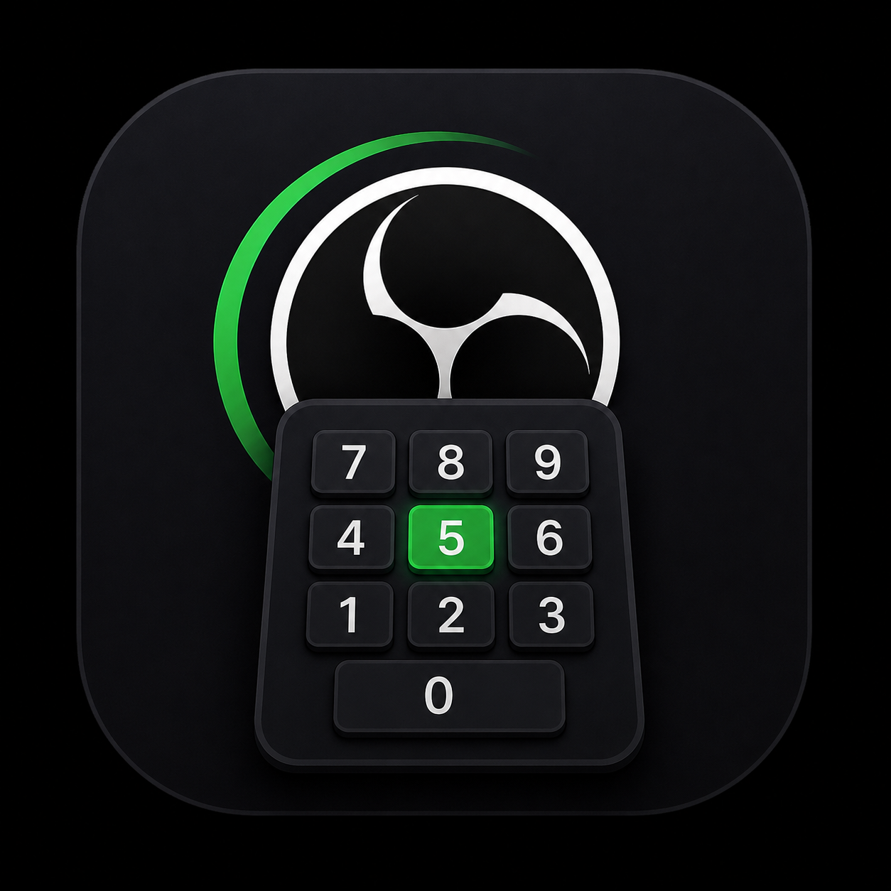
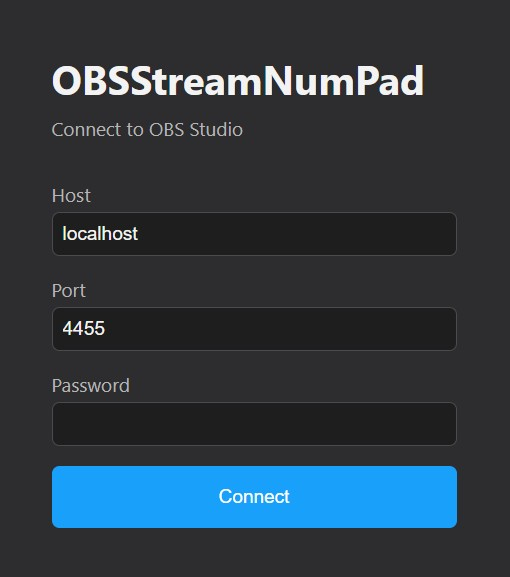
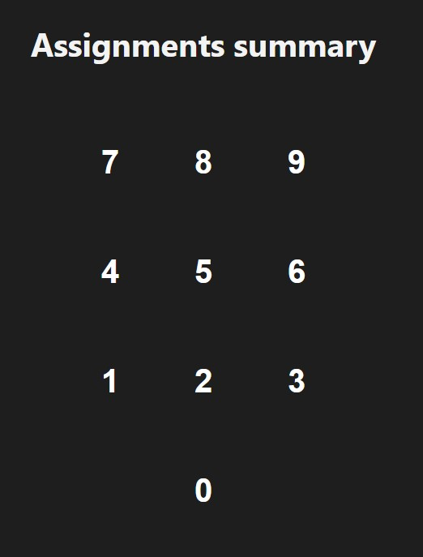
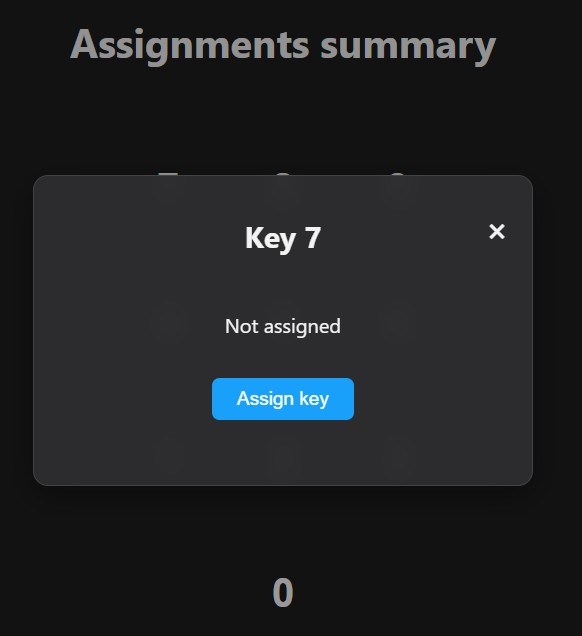
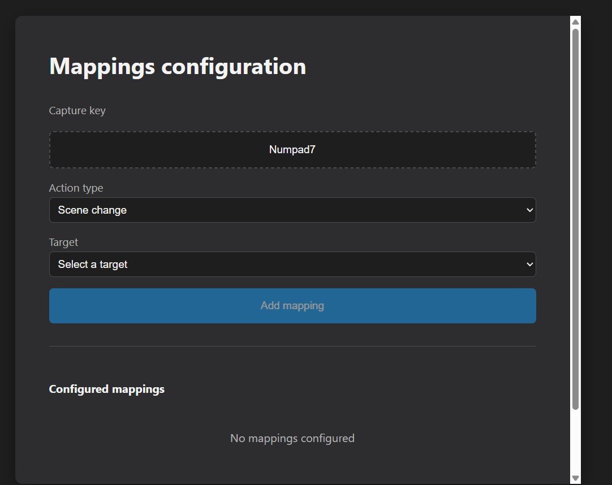
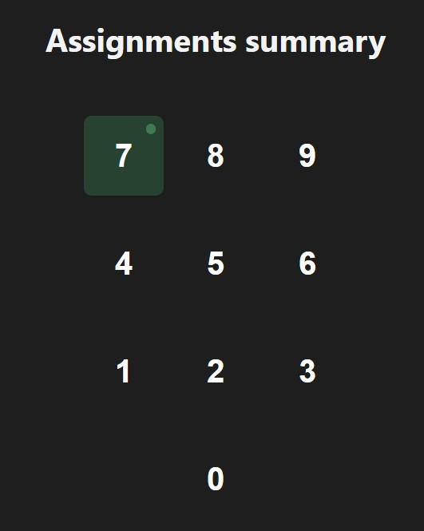

# OBSStreamNumPad

[🇦🇷 Español](README.es.md)

Turn your USB Numpad into a budget StreamDeck for OBS Studio.



## Features

- **Scene switching** — assign a numpad key to switch to any OBS scene
- **Media control** — play/pause media sources with a single key
- **Toggle visibility** — show/hide any input source
- **Persistent settings** — connection data and mappings are saved automatically
- **Bilingual** — English and Spanish

## Requirements

- **Windows** (only supported platform for now)
- **OBS Studio** must be running
- **Num Lock** must be enabled on your keyboard
- Node.js 18+ (for development only)

## Installation

### Option A: Download the .exe (recommended)

1. Go to [Releases](https://github.com/Eloytxo/OBSStreamNumPad/releases) and download the latest `.exe` installer.
2. Run the installer and follow the steps.
3. Launch **OBSStreamNumPad** from the Start Menu or desktop shortcut.

> OBS Studio must be running before you connect.

### Option B: Build from source

```bash
git clone https://github.com/Eloytxo/OBSStreamNumPad.git
cd OBSStreamNumPad
npm install
npm run dev
```

This opens the app in development mode with hot-reload.

## Getting OBS WebSocket Credentials

1. Open **OBS Studio**.
2. Go to **Tools → WebSocket Server Settings**.
3. Make sure the WebSocket server is **enabled**.
4. Click **Show Connect Info** to see the host, port, and password.

## Connection Screen

Enter the host, port, and password from OBS and click **Connect**.



## Summary View

After connecting, you'll see the numpad layout. Keys with no assignment appear blank.



## Assign a Key from Summary

Click any unassigned key to open the detail popup, then click **Assign key** to go directly to the mapping screen with that key pre-selected.



## Mapping Screen

1. Click **Capture key** and press the numpad key you want to assign.
2. Choose the **action type** (Scene change, Media, Toggle visibility).
3. Select the **target** (scene or source name from OBS).
4. Click **Add mapping**.



## Summary with Assignments

Assigned keys show a green indicator. Click any key to see its details or reassign it.



## How It Works with OBS

1. **Start OBS Studio** and make sure the WebSocket server is enabled.
2. **Enable Num Lock** on your keyboard (required for numpad keys to work).
3. **Open OBSStreamNumPad** and connect using the credentials from OBS.
4. **Assign your numpad keys** to scenes, media sources, or visibility toggles.
5. **Press the keys** — OBSStreamNumPad sends the command to OBS via WebSocket in real time.

All mappings are saved locally and persist between sessions.

## Tech Stack

- **Electron** — desktop shell
- **Vue 3** + **Pinia** — UI and state management
- **Vite** — build tool
- **obs-websocket-js** — OBS WebSocket client
- **electron-builder** — packaging

## License

MIT
